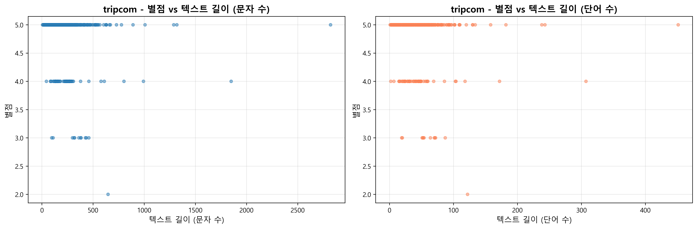
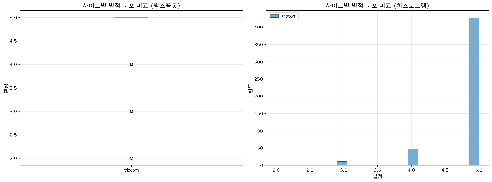

# YBIGTA Newbie Team Project

## 프로젝트 개요
YBIGTA 신입 팀 프로젝트 - 리뷰 데이터 크롤링 및 분석 과제

## 프로젝트 구조
```
YBIGTA_newbie_team_project/
├── database/
│   ├── __init__.py
│   ├── preprocessed_reviews_tripcom.csv
│   └── ...
├── review_analysis/
│   ├── plots/
│   │   └── ...
│   ├── preprocessing/
│   │   ├── base_processor.py
│   │   ├── main.py
│   │   └── ...
│   └── ...
├── README.md
└── ... # 다른 폴더들
```

## 크롤링 대상
- **사이트**: Trip.com
- **대상**: 에버랜드 리뷰
- **수집 개수**: 488개 (전처리 후 486개)

## 실행 방법

### 1. 환경 설정
```bash
pip install -r requirements.txt
```

### 2. 크롤링 실행
```bash
# 모든 크롤러 실행
python main.py -o database --all

# 특정 크롤러만 실행
python main.py -o database -c tripcom
```

### 3. 전처리 및 피처 엔지니어링 실행
```bash
# 명세에 따른 실행 방법
cd review_analysis/preprocessing
python main.py --output_dir ../../database --all
```

### 4. EDA 및 시각화 실행
```bash
python -m review_analysis.visualization.main
```

---

## 1. EDA (탐색적 데이터 분석)

### 1.1 Trip.com 개별 분석

#### 별점 분포


**분석 결과:**
- 별점 분포는 4.0과 5.0에 집중되어 있어 대부분의 리뷰가 긍정적인 경향을 보입니다.
- 평균 별점은 약 4.5점으로 높은 편입니다.
- 박스플롯을 통해 이상치가 거의 없음을 확인할 수 있습니다.

#### 텍스트 길이 분포


**분석 결과:**
- 리뷰 텍스트의 문자 수는 대부분 50~500자 사이에 분포합니다.
- 단어 수는 평균적으로 20~100단어 사이입니다.
- 매우 짧은 리뷰(10자 미만)와 매우 긴 리뷰(1000자 이상)는 소수입니다.

#### 날짜 분포


**분석 결과:**
- 리뷰는 2016년부터 2026년까지 분포되어 있습니다.
- 2020년과 2024-2026년에 리뷰가 집중되어 있습니다.
- 요일별로는 큰 차이가 없으나, 주말에 약간 더 많은 리뷰가 작성되었습니다.
- 시계열 추이를 보면 최근 몇 년간 리뷰 작성이 증가하는 추세입니다.

#### 상관관계 분석


**분석 결과:**
- 별점과 텍스트 길이 간의 명확한 상관관계는 보이지 않습니다.
- 긴 리뷰가 반드시 높은 별점을 의미하지는 않습니다.

#### 단어-별점 상관관계 분석


**분석 결과:**
- 높은 별점과 연관된 단어와 낮은 별점과 연관된 단어를 분석했습니다.
- 각 단어가 등장한 리뷰들의 평균 별점을 계산하여 단어별로 정렬했습니다.
- 버블 크기는 해당 단어가 등장한 리뷰의 개수를 나타냅니다.
- 긍정적인 단어(예: "great", "amazing", "wonderful")는 높은 평균 별점과 연관되어 있습니다.
- 부정적인 단어(예: "disappointed", "poor", "bad")는 낮은 평균 별점과 연관되어 있습니다.

#### 감정 점수-별점 상관관계 분석


**분석 결과:**
- 긍정/부정 단어 사전을 사용하여 각 리뷰의 감정 점수를 계산했습니다.
- 감정 점수 = (긍정 단어 개수 - 부정 단어 개수) / 전체 단어 수 × 100
- 감정 점수와 별점 간의 상관관계를 분석했습니다.
- 감정 점수가 높을수록(긍정적일수록) 별점도 높은 경향을 보입니다.
- 감정 카테고리(부정적, 약간 부정적, 약간 긍정적, 긍정적)별로 평균 별점과 리뷰 개수를 확인할 수 있습니다.

---

## 2. 전처리 및 피처 엔지니어링 (Preprocessing & Feature Engineering)

### 2.1 전처리 과정

#### 칼럼명 통일
- 소스별로 다른 텍스트 칼럼명(`text`, `content`)을 `context`로 통일했습니다.

#### 날짜 데이터 형식 변환
- 모든 날짜 데이터를 `datetime` 타입으로 일괄 변환했습니다.
- 형식: `%b %d, %Y` (예: "Jan 10, 2026")

#### 결측치 처리
- **별점(rating)**: 결측치가 있는 경우 전체 평균값으로 대체했습니다.
- **리뷰(context) 및 날짜(date)**: 결측치가 있는 행은 삭제했습니다.
- 처리 결과: 488개 → 488개 (별점 결측치 없음, context/date 결측치 없음)

#### 이상치 처리
- **기간 이상치**: 2019년 이전 및 2026년 이후 데이터를 제거했습니다.
  - 제거된 데이터: 2개
- **텍스트 이상치**: 3자 미만(2자 이하)의 리뷰를 제거했습니다.
  - 제거된 데이터: 0개
- 최종 데이터: 488개 → 486개

#### 텍스트 전처리
- 줄바꿈 문자를 공백으로 변환
- 연속된 공백을 하나로 통합
- 앞뒤 공백 제거
- `context_cleaned` 컬럼에 정제된 텍스트 저장

### 2.2 피처 엔지니어링

#### 파생 변수 생성

1. **텍스트 관련 변수**
   - `text_len`: 텍스트 길이 (문자 수)
   - `word_count`: 단어 수

2. **별점 관련 변수**
   - `rating_group`: 별점 그룹 (낮음(1-2), 보통(3), 높음(4-5))
   - `is_positive`: 긍정 리뷰 여부 (별점 4 이상이면 1, 아니면 0)

3. **날짜 관련 변수**
   - `year`: 연도
   - `month`: 월
   - `day`: 일
   - `weekday`: 요일 (Monday, Tuesday, ...)
   - `weekday_num`: 요일 번호 (0=월요일, 6=일요일)
   - `year_month`: 연도-월 (예: "2026-01")

4. **텍스트 특성 변수**
   - `text_has_emoji`: 이모지 포함 여부 (1: 포함, 0: 미포함)
   - `text_has_url`: URL 포함 여부 (1: 포함, 0: 미포함)

#### 텍스트 벡터화

**TF-IDF 벡터화**를 사용했습니다:
- 최대 100개의 주요 단어 선택
- 영어 불용어 제거
- 1-gram과 2-gram 사용
- 최소 2개 문서에 등장해야 함
- 95% 이상 문서에 등장하는 단어는 제외

**차원 축소:**
- TruncatedSVD를 사용하여 20차원으로 축소
- `tfidf_vector_1` ~ `tfidf_vector_20` 컬럼 생성

**주요 키워드 추출:**
- 각 리뷰별로 상위 5개 키워드를 추출하여 `top_keywords` 컬럼에 저장

### 2.3 전처리 결과

- **원본 데이터**: 488 rows × 3 columns
- **전처리 후 데이터**: 486 rows × 37 columns
- **저장 파일**: `database/preprocessed_reviews_tripcom.csv`

---

## 3. 비교 분석 (Comparison Analysis)

### 3.1 별점 비교


**분석 결과:**
- 현재 Trip.com 데이터만 있으므로 단일 사이트 분석입니다.
- 향후 다른 사이트 데이터가 추가되면 사이트별 별점 분포를 비교할 수 있습니다.

### 3.2 텍스트 길이 비교


**분석 결과:**
- 리뷰 텍스트의 문자 수와 단어 수 분포를 확인할 수 있습니다.
- 대부분의 리뷰가 적절한 길이를 유지하고 있습니다.

### 3.3 시계열 비교


**분석 결과:**
- 연도-월별 리뷰 개수 추이를 확인할 수 있습니다.
- 2020년과 2024-2026년에 리뷰가 집중되어 있습니다.

### 3.4 키워드 비교


**분석 결과:**
- TF-IDF 벡터화를 통해 추출된 주요 키워드를 확인할 수 있습니다.
- "everland", "seoul", "korea", "pandas" 등의 키워드가 자주 등장합니다.

### 3.5 별점 그룹 비교


**분석 결과:**
- 대부분의 리뷰가 "높음(4-5)" 그룹에 속합니다.
- "보통(3)" 그룹과 "낮음(1-2)" 그룹의 리뷰는 소수입니다.

---

## 기술 스택
- **Python 3.x**
- **Selenium**: 동적 웹 크롤링
- **BeautifulSoup4**: HTML 파싱
- **WebDriver Manager**: Chrome 드라이버 관리
- **Pandas**: 데이터 처리 및 분석
- **NumPy**: 수치 연산
- **scikit-learn**: 머신러닝 (TF-IDF, SVD)
- **Matplotlib**: 데이터 시각화

---

## 데이터 확인
`database/README.md` 파일에서 데이터 소개 및 상세 실행 방법을 확인할 수 있습니다.
