# YBIGTA Newbie Team Project

## 👥 팀 소개

## YBIGTA 26-1 교육세션 6조  
저희 6조는 데이터 분석과 서비스 개발에 관심을 가진 팀원들이 모인 팀입니다.
웹·크롤링·EDA 과제를 함께 수행하며 데이터가 실제 인사이트로 이어지는 과정을 직접 경험하고자 합니다.
서로의 의견을 편하게 나누고, 함께 고민하며 배우는 과정을 중요하게 생각하는 팀입니다 😊

### 👤 팀원 1. 남건우 (조장)

💬 **한마디**  
> 저는 6조 조장 남건우입니다!  
> 산업공학과 21학번이고, 데이터 분석과 문제 해결 과정에 흥미가 있습니다.  
> 이번 팀 프로젝트를 통해 협업 경험을 쌓고, 서로에게 배울 수 있기를 기대합니다. 잘 부탁드립니다 :)

### 👤 팀원 2: 박정현

💬 **한마디**  
> 저는 산업공학과 22학번 박정현입니다!  
> 저는 실제 서비스를 개발하는 데 관심이 있고, 그 과정을 명확히 하고자 YBIGTA 에 들어오게 되었습니다.  
> 앞으로 자주 이야기하고 학회 활동 열심히 해보아요!!  

### 👤 팀원 3: 장주원

💬 **한마디**  
> 안녕하세요, 첨단컴퓨팅학부 25학번 장주원입니다.  
> 데이터 분석과 인공지능, 그리고 실제 서비스에 사용되는 개발 지식을 공부하고 싶어 YBIGTA에 들어오게 되었습니다.  
> 조별과제를 통해 좋은 협업 경험을 쌓고 싶습니다. 잘 부탁드립니다.  

---
## 8. DB, Docker, AWS

### 1) DB Configuration

프로젝트의 목적에 따라 관계형 데이터베이스(MySQL)와 비관계형 데이터베이스(MongoDB)를 혼합하여 구축하였습니다.

* **User Data (MySQL)**: 사용자 정보의 생성, 조회, 수정, 삭제(CRUD)를 담당합니다. 클라우드 환경에서는 **AWS RDS**를 활용하여 호스팅합니다.


* **Review Data (MongoDB)**: 크롤링한 원본 데이터와 전처리된 데이터를 저장합니다. 클라우드 환경에서는 **MongoDB Atlas**를 활용합니다.


* **Preprocessing Automation**: `/review/preprocess/{site_name}` API를 통해 MongoDB에 저장된 원본 데이터를 자동으로 전처리하여 다시 저장하는 로직을 구현하였습니다.


### 2) Docker Hub

애플리케이션의 환경 의존성을 해결하기 위해 Docker 이미지를 생성하고 Docker Hub에 배포하였습니다.

* **Docker Hub Repository**: `https://hub.docker.com/repository/docker/geonunam/ybigta-assignment/` 


* **Security**: `.env`와 같은 민감 정보가 포함되지 않도록 `.dockerignore` 파일을 설정하여 보안을 강화하였습니다.


### 3) AWS Deployment & API Results

AWS EC2 인스턴스를 생성하고, Docker Hub에서 이미지를 Pull 받아 컨테이너를 실행하였습니다.

**API 실행 결과 (Swagger)** 

> 모든 API는 EC2 퍼블릭 IP 환경에서 정상 작동함을 확인하였습니다. (파일명: `aws/*.png`)

| API Endpoint     | Description       | Screenshot                          |
|------------------|-------------------|-------------------------------------|
| `/api/user/register` | 유저 회원가입           | 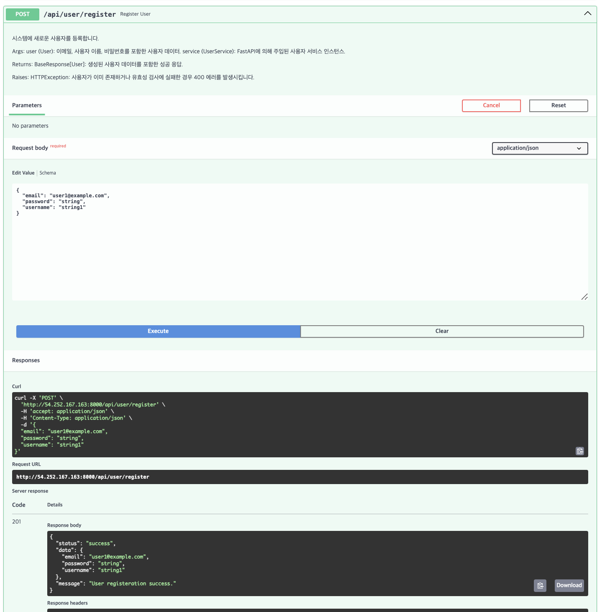       |
| `/api/user/login` | 유저 로그인            | 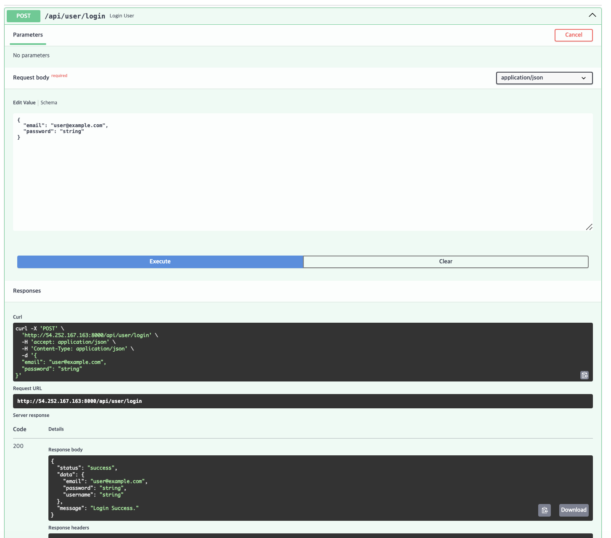             |
| `/api/user/update-password` | 유저 비밀번호 변경        | 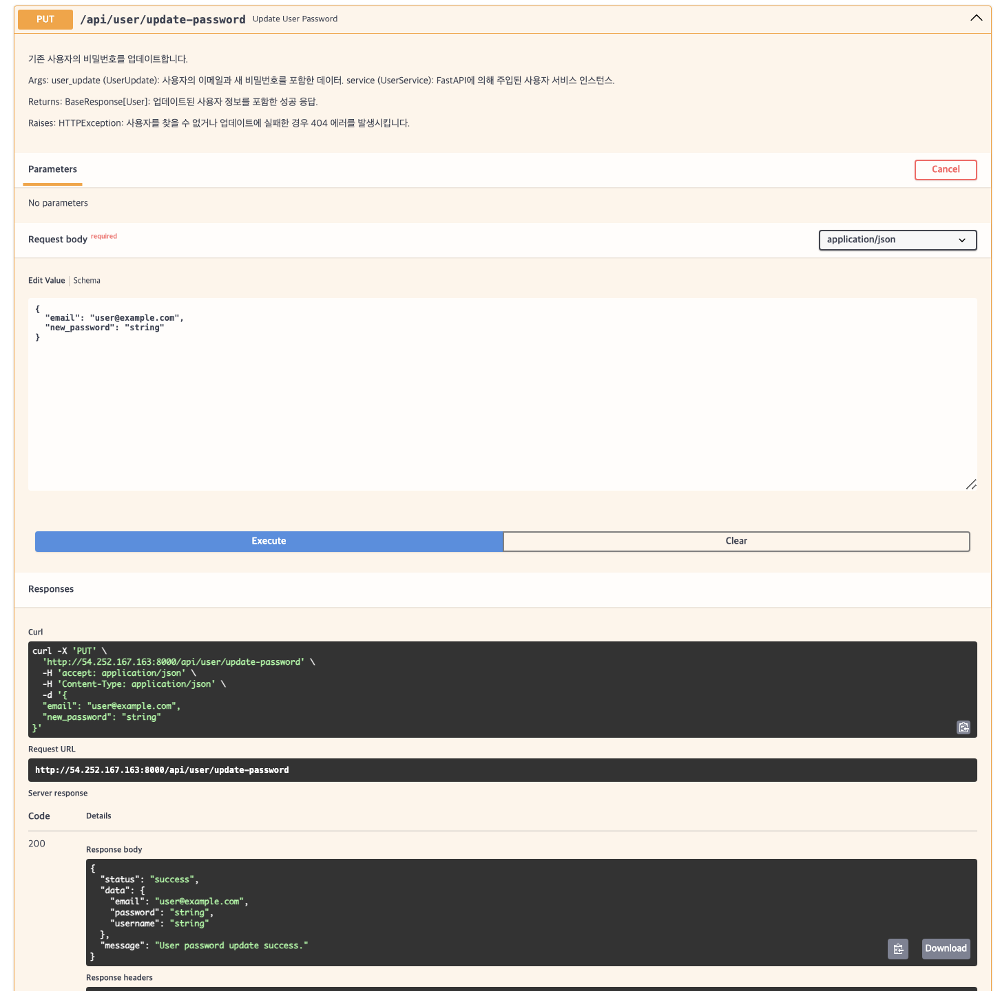 |
| `/api/user/delete`     | 유저 정보 제거          | 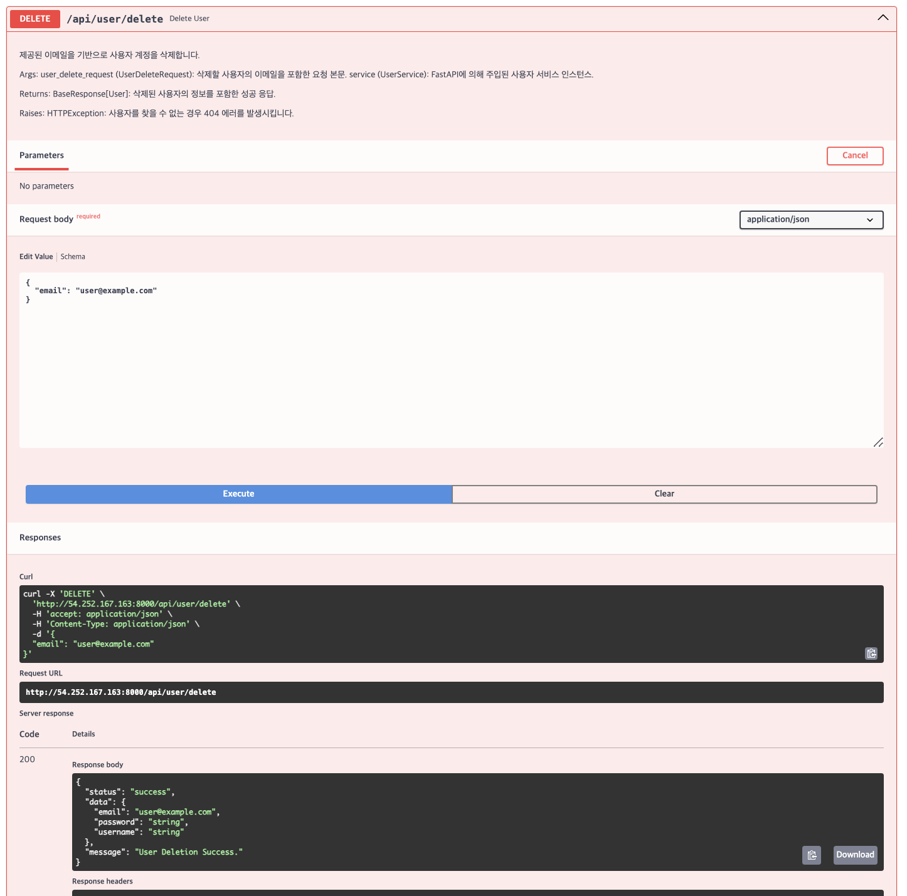          |
| `/review/preprocess/{site_name}` | 데이터 전처리 | 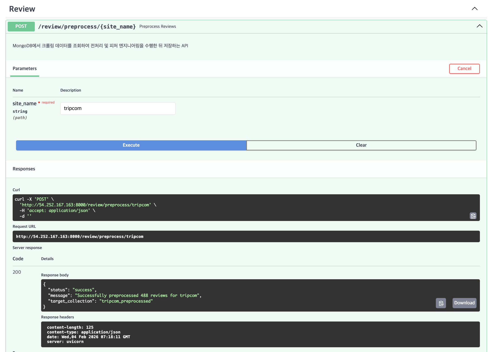   |

---

### 4) GitHub Action (CI/CD)

코드 변경 시마다 반복되는 빌드 및 배포 과정을 자동화하기 위해 **GitHub Actions**를 사용하였습니다.

Workflow 구조 

1. **Build and Push Docker Image**: 변경된 코드를 바탕으로 Docker 이미지를 빌드하고 Docker Hub에 Push합니다.


2. **Deploy to EC2**: EC2 인스턴스에 접속하여 최신 이미지를 Pull 받고 컨테이너를 재실행합니다.


Pipeline 관리 

* **GitHub Secrets**: Docker ID, Password, EC2 IP, PEM Key 등 보안이 필요한 변수들은 Repository Secrets로 안전하게 관리합니다.


* **배포 성공 확인**

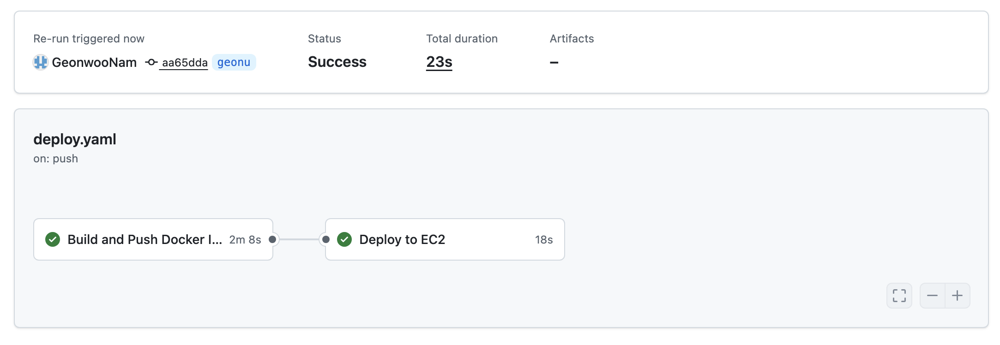

---

### 5) VPC를 활용하여 보안 설정

이번 프로젝트에서는 서비스의 보안성을 위해 **VPC(Virtual Private Cloud)** 환경을 설계하고 적용하였습니다. 

### VPC 및 네트워크 계층 구조

* **VPC 정의**: 물리적으로 동일한 AWS 클라우드 자원 내에서 논리적으로 격리된 가상 네트워크 환경을 의미합니다. 이를 통해 사용자만의 독립적인 네트워크를 구성하고 트래픽 흐름을 제어할 수 있습니다. 


* **서브넷 구성**: 외부망과 연결되는 **Public Subnet**(EC2 배치)과 외부 접근이 완전히 차단된 **Private Subnet**(RDS 배치)으로 계층화하였습니다. 


위 이미지의 리소스 맵을 보면 `RDS-Pvt-subnet`들이 구성되어 있으며, 인터넷 게이트웨이(IGW)는 특정 경로를 통해서만 연결된 것을 확인할 수 있습니다.


### 인스턴스 간 접근 제어 (Security Group)

단순히 네트워크를 분리하는 것을 넘어, 보안 그룹(Security Group)을 통해 "EC2를 거쳐야만 RDS에 접근할 수 있는" 구조를 구현했습니다. 

* **RDS 보안 설정**: RDS의 인바운드 규칙에 모든 IP(`0.0.0.0/0`)가 아닌, **EC2가 속한 보안 그룹 ID**만 허용하도록 설정하였습니다. 


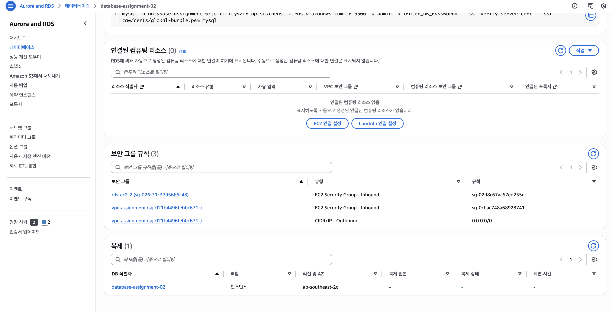
위 이미지의 보안 그룹 규칙을 보면, 특정 보안 그룹(`sg-02d8c67...` 등)으로부터의 트래픽만 허용하고 있는 것을 볼 수 있습니다.


* **데이터베이스 접근**: 이를 통해 외부 사용자는 DB에 직접 연결할 수 없으며, 오직 배포된 애플리케이션(EC2)을 통해서만 데이터를 CRUD 할 수 있습니다. 
*   인터넷 요청이 게이트웨이를 지나 EC2(보안 그룹 1)에 도달하고, EC2가 다시 RDS(보안 그룹 2)로 요청을 보내는 안전한 흐름을 확인할 수 있습니다.

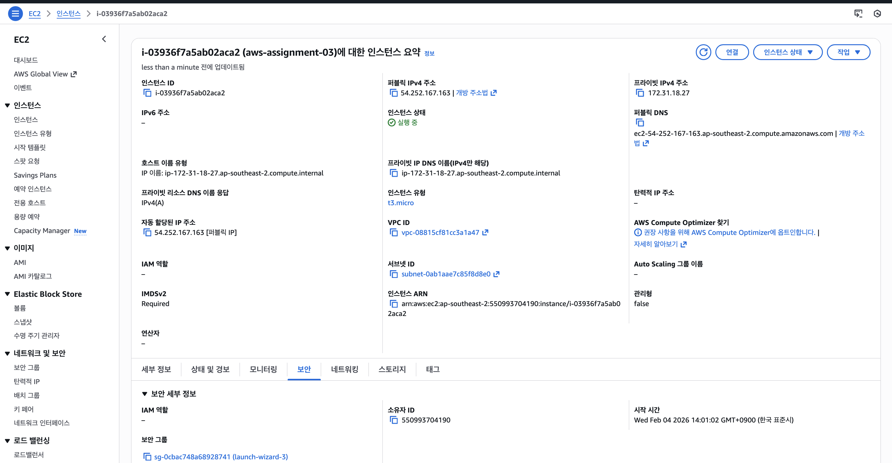
위 이미지를 확인하면 생성된 EC2 인스턴스의 퍼블릭 IPv4 주소(54.252.167.163) 를 확인할 수 있습니다. 모든 API endpoint는 해당 퍼블릭 IP와 할당된 포트를 통해 외부에서 접근 가능하며, Swagger를 통해 총 5개의 API가 성공적으로 응답하는 것을 확인하였습니다.

### 기타 관련 첨부 이미지
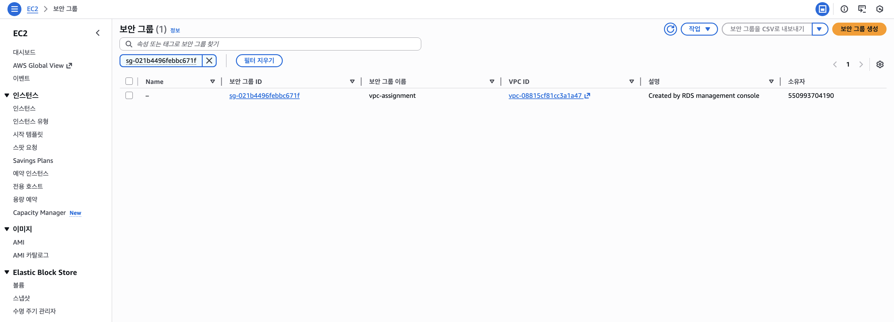


---

### 6) 프로젝트를 진행하며 깨달은 점

### 1. 과금 방지를 통해 AWS 리소스 수명 관리의 중요성 인식

과제 종료 후 RDS와 EC2를 삭제하는 과정에서, 리소스를 "삭제했다"는 것과 "과금이 완전히 종료되었다"는 것이 다를 수 있다는 점을 체감했습니다. 

* **RDS Final Snapshot**: DB 인스턴스를 삭제하더라도 최종 스냅샷을 생성하도록 설정하면 해당 데이터가 스토리지 비용을 발생시킨다는 점을 배웠습니다. 


* **EBS 볼륨**: EC2 삭제 시 '종료 시 삭제' 옵션을 체크하지 않으면 독립적인 EBS 볼륨으로 남아 계속 과금된다는 점을 확인했습니다.


* **인사이트**: AWS 환경에서는 리소스 생성뿐 아니라 **수명 관리와 깔끔한 정리(Clean-up)**까지가 진정한 작업의 마무리라는 인식을 갖게 되었습니다. 


### 2. GitHub Actions는 "코드 자동화"가 아니라 "환경 자동화"

단순히 코드를 빌드하는 것을 넘어, Docker Hub, EC2, Secrets, SSH 인증 등 복잡한 외부 환경을 연결하는 파이프라인의 핵심임을 깨달았습니다. 

* **Workflow 파일의 엄격성**: `.github/workflows/`라는 정확한 경로와 특정 브랜치 이벤트가 트리거가 되어야만 실행되는 **"GitHub 서버에서 동작하는 코드"**라는 개념을 명확히 했습니다. 


* **인사이트**: 로컬 환경과 원격 실행 환경의 구분이 CI/CD의 핵심임을 이해하게 되었습니다.

### 3. 클라우드 인프라의 일관성과 리전(Region) 및 VPC 설계의 중요성

단순히 인스턴스를 생성하는 것을 넘어, 서비스 간의 원활한 통신을 위해 인프라의 **지리적·논리적 일관성**이 왜 중요한지 체감했습니다.

* **리전(Region) 불일치 문제**: 초기 설정 시 EC2와 RDS를 서로 다른 리전에 생성하여 통신 지연 및 연결 실패를 겪었습니다. 이후 모든 자원을 **ap-southeast-2(시드니)** 리전으로 통일하여 안정적인 내부 네트워크망을 확보하였습니다.


* **VPC 내부 라우팅**: 보안을 위해 RDS를 Private Subnet에 배치하면서, EC2가 위치한 Public Subnet과의 라우팅 테이블 및 보안 그룹 설정을 맞추는 과정에서 VPC의 논리적 구조를 깊이 이해하게 되었습니다.


* **인사이트**: 클라우드 아키텍처 설계 시 **리전 선택과 네트워크 계층 분리**가 성능과 보안, 그리고 비용에 직결되는 핵심 요소임을 배웠습니다.

### 4. 환경 변수와 특수문자 처리를 통한 애플리케이션 디버깅

Docker 환경에서 배포된 서버가 API 500 에러를 지속적으로 반환하는 문제를 해결하며, **환경 변수 관리**의 세밀함을 배웠습니다.

* **MongoDB URL 인코딩 문제**: MongoDB Atlas 연결을 위한 URL에 포함된 **비밀번호 특수문자(`*`)**가 환경 변수로 전달되는 과정에서 문자열 파싱 오류를 일으켜 DB 연결 실패(API 500)를 유발했습니다.


* **해결 과정**: 에러 로그를 추적하여 DB 커넥션 단계의 문제임을 파악하였고, URL 인코딩(Percent-encoding)을 적용하거나 환경 변수 주입 방식을 개선하여 문제를 해결했습니다.


* **인사이트**: 컨테이너화된 환경에서는 설정값 하나가 전체 서비스 가용성에 치명적인 영향을 줄 수 있으며, 특히 **민감 정보(Secrets)와 환경 변수를 다룰 때의 엄격한 규격 준수**가 필수적임을 깨달았습니다.

### 5. SSH 인증 오류 해결을 통한 보안 구조 체득

EC2 배포 단계에서 발생한 SSH 접속 실패 문제를 해결하며 키 기반 인증 구조를 깊이 있게 이해하게 되었습니다.

* **Secrets 관리**: GitHub Secrets에는 단순히 파일명이 아니라 **PEM 키의 실제 내용(Header/Footer 포함 전체)**을 저장해야 함을 알게 되었습니다.


* **사용자명(User) 식별**: AMI 종류에 따라 기본 사용자명(`ubuntu` vs `ec2-user`)이 다르며, 이 정보가 인증의 성공 여부를 결정하는 결정적 요인임을 확인했습니다.


* **인사이트**: 이 과정을 통해 SSH 키 기반 인증의 원리와 GitHub Actions에서의 안전한 보안 정보 관리 방식을 실무적으로 체감할 수 있었습니다.

---

## 실행 방법

### 1. 환경 설정
```bash
pip install -r requirements.txt
```

### 2. 크롤링 실행
* 경로 문제가 있을 수 있습니다. 주의해주시면 감사드리겠습니다!
```bash
cd review_analysis/crawling
python main.py -o ./database --all
```

### 3. 전처리 및 피처 엔지니어링 실행
```bash
# 명세에 따른 실행 방법
cd ../preprocessing
python main.py --output_dir ../../database --all
```

### 4. EDA 및 시각화 실행
```bash
cd ../..
python -m review_analysis.visualization.main
```

---

## 3-2. 크롤링 과제 

1) 데이터 소개 

본 프로젝트는 **에버랜드** 를 대상으로 다양한 사이트의 리뷰 데이터를 수집하였습니다.

| 사이트 | 링크 | 수집 개수 |
| --- | --- | --- |
| **Trip.com** | [링크](https://us.trip.com/review/everland-10558712-244874246?locale=en-US&curr=KRW) | 488개
| **Google Maps** | [링크](https://www.google.com/maps) | 500개
| **Kakao Map** | [링크](https://place.map.kakao.com/784414359#review) | 500개 

* **데이터 형식**: CSV (UTF-8 with BOM) 


* **저장 위치**: `database/reviews_{사이트이름}.csv` 


2) 실행 방법 

* 위의 실행방법 부분을 참고해주시면 감사하겠습니다!

---

## 4-1. EDA & FE, 시각화 과제 


### 1. EDA (Exploratory Data Analysis)
각 사이트별 리뷰 데이터의 특성과 분포를 시각화하여 분석하였습니다. 
1) 데이터 분포 파악 (Distribution Analysis)  
각 플랫폼별로 별점, 텍스트 길이, 작성 날짜의 분포를 확인하여 데이터의 전반적인 경향성을 파악했습니다.
* Google 별점, 텍스트 길이, 날짜 분포

* Kakao 별점, 텍스트 길이, 날짜 분포

* Tripcom 별점, 텍스트 길이, 날짜 분포

* 별점 분포:  
대부분의 플랫폼에서 4-5점대의 고득점 리뷰가 지배적입니다. 특히 구글과 트립닷컴은 긍정적인 평가의 비중이 매우 높으나, 카카오맵의 경우 상대적으로 낮은 별점(1~2점)의 비율이 타 플랫폼 대비 높게 나타나는 특성을 보입니다.
* 텍스트 길이 분포:   
대부분 100자 미만의 단문 리뷰가 주를 이룹니다. 트립닷컴은 외국인 및 여행객의 상세 가이드형 리뷰가 많아 평균 텍스트 길이가 가장 길게 형성되어 있습니다.
* 날짜별 리뷰 분포:   
구글과 카카오는 2019년부터 리뷰가 안정적으로 축적되어 장기적인 이용 추이를 파악하기에 용이하며, 트립닷컴은 2023년 이후 리뷰가 급증하였는데 이는 코로나의 영향으로 보입니다. 카카오는 비교적 수집되는 데이터 볼륨이 높아 비교적 최근 데이터가 많았습니다.

2) 이상치 파악 및 처리 근거 (Outlier Detection)  
분석의 신뢰도를 높이기 위해 비정상적인 범위의 데이터를 정의하고 제거 근거를 마련했습니다.

① 텍스트 길이 이상치
의미 없는 자음/모음 나열이나 단발성 이모티콘 등, 텍스트 분석(키워드 추출 및 벡터화)에 부적합한 '3자 미만(2자 이하)'의 리뷰를 이상치로 분류했습니다.

| Rating | Date       | Content (Raw) | Length | 판단 결과 |
|---|---|---|---|---|
| 5.0    | 2023-07-25 | ㅛ             | 1      | 제거 (의미 없는 자음) |
| 3.0    | 2025-02-16 | 굿             | 1      | 제거 (정보량 부족) |
| 5.0    | 2025-12-25 | 👍👍           | 2      | 제거 (이모티콘 노이즈) |
| 1.0    | 2025-03-25 | ㅇㅇ           | 2      | 제거 (단답형 노이즈) |

② 기간(날짜) 이상치
플랫폼 간의 공정한 비교와 최신 트렌드 반영을 위해, 데이터가 극소수이거나 특정 플랫폼에만 치중된 과거 데이터를 이상치로 판단했습니다.

| Year | Google       | Kakao | Trip.com | Total | 비고 |
|---|---|---|---|---|---|
|2019~2026|	472|	500|	480|	1452|	분석 대상|
|2018 이전	|28|	0	|2	|30|	제거 (데이터 부족)|

* 판단 근거: 2018년 이전 데이터는 전체의 약 2% 미만으로 통계적 유의성이 낮으며, 특히 카카오 등 특정 플랫폼의 데이터가 전무하여 플랫폼 간 비교 분석 시 왜곡을 초래할 수 있습니다. 따라서 2019년 1월 1일 이후 데이터만 사용하기로 결정했습니다.
 
---


### 2) 전처리 및 FE (Feature Engineering) 

`BaseDataProcessor`를 상속받아 아래 작업을 수행하였습니다.

### 1. 데이터 정제 및 이상치 처리 (Data Cleaning & Outliers)
실제 분석에 방해가 되는 노이즈 데이터를 엄격한 기준에 따라 필터링했습니다.

결측치 처리 (Missing Values):
* rating 결측치는 데이터 손실을 최소화하기 위해 전체 평균값으로 대체했습니다.
* 핵심 정보인 context(리뷰 본문)와 date가 없는 행은 분석 대상에서 제외했습니다.

이상치 제거 (Outlier Removal):
* 기간 필터링: 2019년 이전 또는 2026년 이후의 데이터는 최신 트렌드 분석을 위해 제외했습니다.
* 별점 검증: 1.0~5.0 범위를 벗어난 비정상적인 별점 데이터를 제거했습니다.
* 텍스트 길이: 텍스트가 3자 미만(2자 이하)인 단순 이모티콘이나 무의미한 리뷰를 제거하여 분석의 질을 높였습니다.

### 2. 텍스트 데이터 전처리 (Text Preprocessing)
한국어와 영어의 언어적 특성을 고려하여 이원화된 전처리 과정을 수행합니다.

공통 전처리: 줄바꿈 및 불필요한 연속 공백 제거, 앞뒤 공백 트리밍을 통해 텍스트를 규격화했습니다.

한국어 형태소 분석 (Google/Kakao):
* soynlp 등의 라이브러리를 우선 시도하고, 환경에 따라 유연하게 작동하는 tokenize_korean_simple 엔진을 자체 구현했습니다.
* 명사, 동사, 형용사, 부사 등 의미가 분명한 형태소 위주로 추출하여 텍스트 데이터의 차원을 효율적으로 관리합니다.

영어 텍스트 정제 (Trip.com):
* 영문 불용어(english stop words) 제거를 통해 분석의 유의미성을 확보했습니다.

### 3. 파생 변수 생성 (Feature Engineering)
단순 수집된 데이터를 넘어, 분석 인사이트를 제공할 수 있는 다양한 파생 변수를 생성했습니다.
* 텍스트 관련: text_len(문자 수), word_count(단어 수)를 통해 리뷰의 충실도를 수치화했습니다.
* 별점 관련: 별점을 낮음(1-2), 보통(3), 높음(4-5)의 3단계 그룹(rating_group)으로 범주화하고, 4점 이상을 긍정(is_positive)으로 정의했습니다.
* 날짜 관련: year, month, day, weekday(요일), year_month 등 시계열 분석을 위한 다각도의 변수를 추출했습니다.
* 특성 감지: 이모지 포함 여부(text_has_emoji) 및 URL 포함 여부(text_has_url)를 체크하여 리뷰의 스타일을 분류했습니다.

### 4. 텍스트 벡터화 및 임베딩 (Vectorization)
머신러닝 알고리즘이 이해할 수 있는 수치형 데이터로의 변환을 수행했습니다.

* TF-IDF Vectorization: 단어의 출현 빈도와 중요도를 고려한 TfidfVectorizer를 사용하여 상위 100개의 핵심 키워드 피처를 생성했습니다.
* Dimensionality Reduction: 생성된 고차원 벡터를 TruncatedSVD를 통해 20차원의 핵심 벡터로 압축하여 연산 효율성을 높였습니다.
* Keyword Extraction: 각 리뷰에서 TF-IDF 점수가 가장 높은 상위 5개 키워드를 top_keywords 컬럼으로 추출하여 요약된 정보를 제공합니다.

---

### 3) 비교 분석 

세 플랫폼(Google, Kakao, Trip.com)의 데이터를 통합하여 비교한 결과입니다.

Rating Distribution (별점 분포 비교):

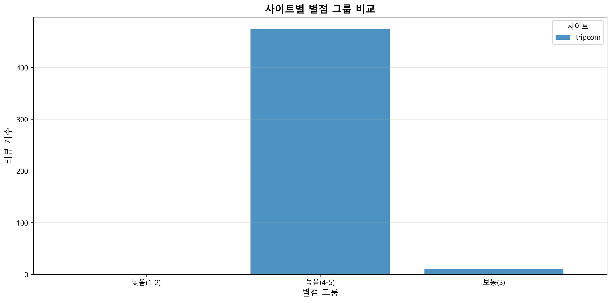

* 모든 플랫폼에서 4~5점대의 고득점 리뷰가 압도적으로 많습니다.

* 특히 Trip.com은 낮은 별점이 거의 없는 가장 긍정적인 분포를 보입니다.

Top Keywords (상위 키워드 비교):

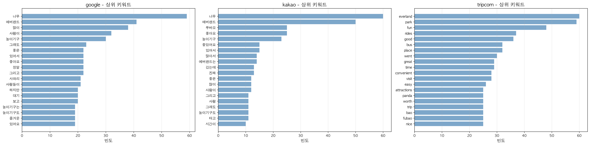

* Google/Kakao: '에버랜드', '너무', '사람이', '놀이기구' 등 한글 기반의 핵심 키워드가 주를 이룹니다.

* Trip.com: 'Everland', 'park', 'fun', 'rides' 등 영어 기반의 키워드가 추출되어 외국인 이용객의 시각을 대변합니다.

Review Text Length (텍스트 길이 비교):

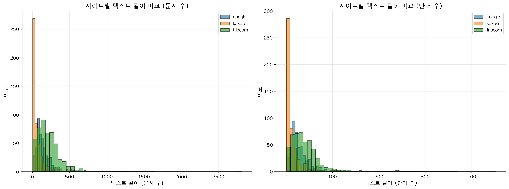

* Kakao Map 리뷰의 경우 아주 짧은 단답형 리뷰의 빈도가 매우 높게 나타납니다.

* 반면 Google과 Trip.com은 상대적으로 긴 문장의 리뷰 분포가 더 넓게 퍼져 있어 상세한 정보 제공이 많음을 알 수 있습니다.

Time-series Trends (시계열 리뷰 추이):

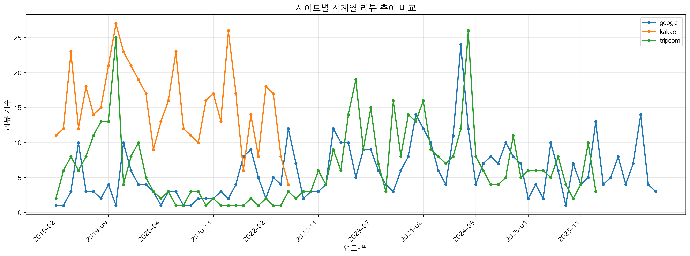

* Kakao: 2019년부터 꾸준한 데이터를 보유하고 있습니다.

* Google: 2024년 이후 데이터가 급증하는 추세를 보입니다.

* Trip.com: 2023년 중반에 리뷰 수가 일시적으로 피크를 찍는 구간이 발견됩니다.

---

### 4-1) 개별 분석 - Google

### 1. Rating Distribution (별점 분포)
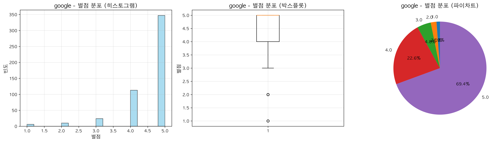

Insights:

* 압도적인 긍정 비율: 전체 리뷰의 69.4%가 5점, 22.6%가 4점으로, 전체의 약 92% 이상이 긍정적인 평가를 보이고 있습니다.

* 데이터 집중도: Boxplot 확인 결과 중앙값이 5점에 위치하며, 1~2점대의 낮은 별점은 이상치(Outlier)로 보일 만큼 적은 비중을 차지합니다.

### 2. Text Length Analysis (리뷰 길이 분석)


Insights:

* 간결한 리뷰 선호: 리뷰 길이는 주로 100자 내외(문자 수), 20~30단어 내외에서 가장 높은 빈도를 보입니다.

* 정보 밀도: 400자 이상의 장문 리뷰는 드물지만, 이러한 유저들은 주로 별점과 관계없이 상세한 경험을 공유하는 경향이 있습니다.

### 3. Temporal Patterns (시간별 방문 및 리뷰 패턴)
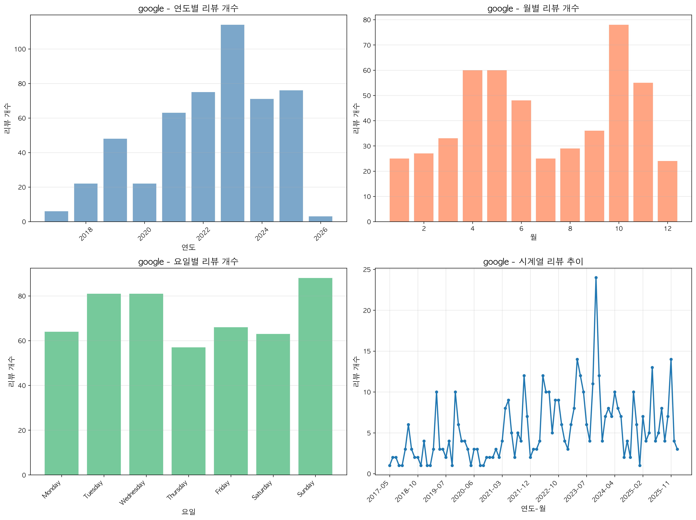

Insights:

* 성장 추세: 2021년 이후 리뷰 수가 급격히 증가하여 2023년에 정점을 찍었습니다.

* 시즌성: 월별 분석 시 10월에 리뷰 수가 가장 많으며, 이는 가을 시즌 에버랜드 방문객 증가와 일치합니다.

* 요일별 특성: 주말(Sunday)뿐만 아니라 평일 중에는 화요일과 수요일의 리뷰 작성 빈도가 높게 나타나는 특이점이 발견됩니다.

### 4. Keyword & Sentiment Insights (키워드 및 감성 분석)
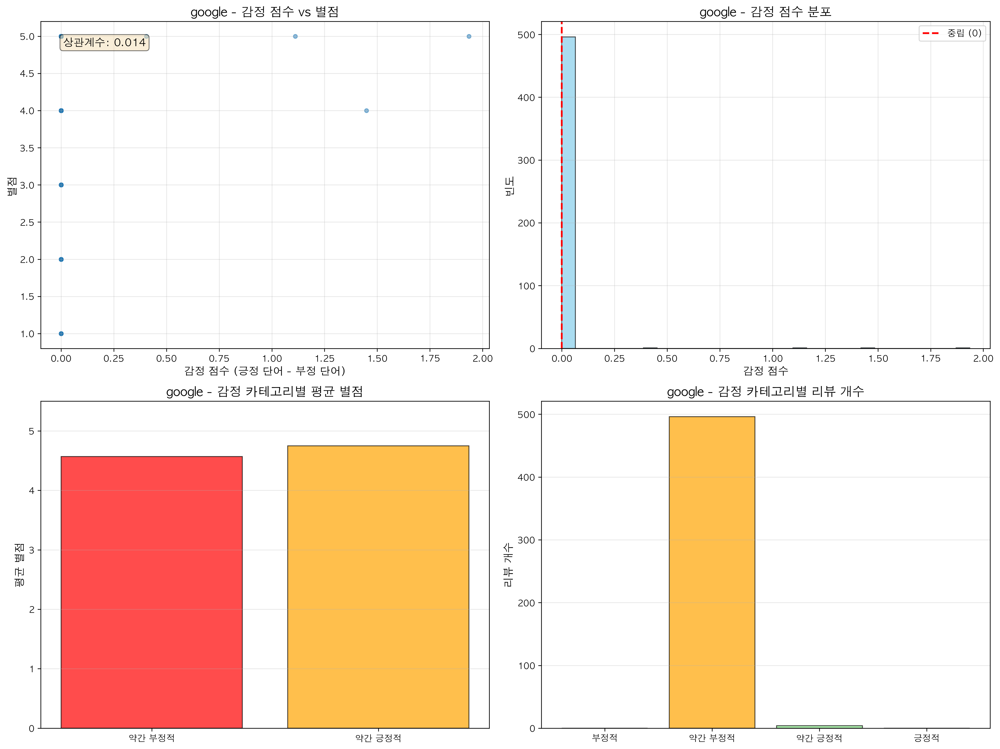  

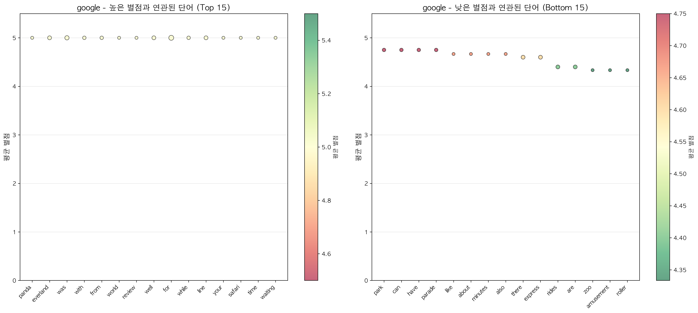

Insights:

* 고득점 키워드: 'panda', 'everland', 'safari' 등 특정 콘텐츠와 관련된 단어들이 5점 만점의 평점과 강력하게 연결되어 있습니다.

* 페인 포인트(Pain Point): 상대적으로 낮은 점수(4점대 초반)와 연관된 단어로는 'waiting', 'roller', 'express' 등이 등장하며, 이는 대기 시간이 사용자 만족도에 영향을 주는 주요 요인임을 시사합니다.

* 감성-별점 상관관계: 감성 점수와 별점 간의 상관계수는 약 0.014로 수치적 선형성은 낮으나, 시각화 결과 대부분의 감성이 '약간 긍정' 이상의 영역에 밀집되어 있습니다.
  

* 더 자세한 내용은 review_analysis/plots/ 폴더 내에서 확인 가능합니다!

---

### 4-2) 개별 분석 - Kakao

카카오맵의 리뷰 데이터를 기반으로 별점, 텍스트 길이, 시간적 분포 및 감성 상관관계를 분석한 결과입니다.

### 1. Rating Distribution (별점 분포)
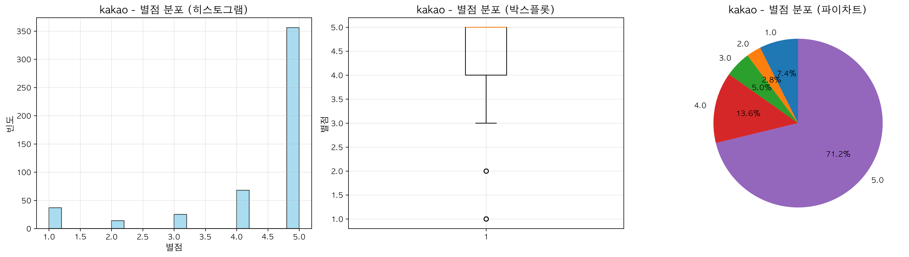

Insights:

* 긍정적 평가의 지배적 비중: 전체 리뷰 중 '5점이 71.2%'로 가장 압도적인 비중을 차지하며, 4점(13.6%)을 포함하면 84% 이상의 유저가 높은 만족도를 보이고 있습니다.

* 평균의 상향 평준화: Boxplot 상에서 중앙값(Median)이 5점에 위치하며, 대부분의 데이터가 4~5점 사이에 밀집되어 있습니다.

* 부정 리뷰의 존재: 1점대 리뷰가 7.4%로 구글에 비해 상대적으로 명확한 불만족 층이 존재함을 확인할 수 있습니다.

### 2. Text Length Analysis (리뷰 길이 분석)
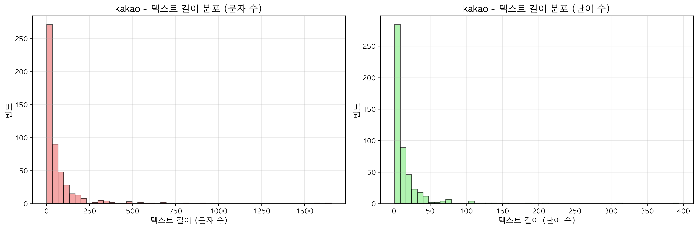

Insights:

* 극단적인 단문 위주: 텍스트 길이 분포를 보면 0~50자 사이의 아주 짧은 리뷰 빈도가 압도적으로 높습니다.

* 단답형 피드백: 단어 수 기준으로는 10단어 미만의 리뷰가 가장 많아, 상세한 설명보다는 빠른 별점 위주의 피드백이 주를 이루는 플랫폼 특성을 반영합니다.

### 3. Temporal Patterns (시간별 리뷰 추이)
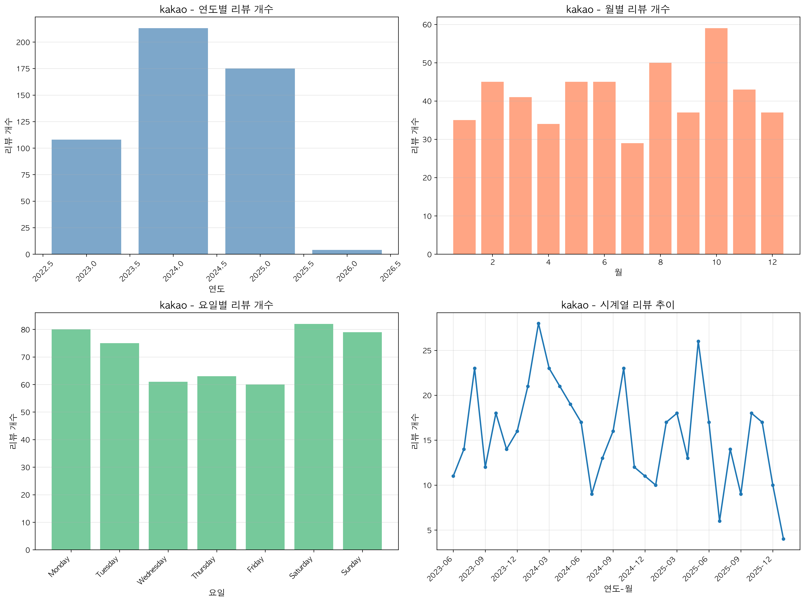

Insights:

* 지속적 성장세: 2022년부터 리뷰 수가 급증하기 시작하여 2024년에 최대치를 기록했습니다.

* 시즌 및 요일 특성: 월별로는 10월에 가장 많은 리뷰가 작성되었으며, 요일별로는 일요일과 월요일의 작성 빈도가 높아 주말 방문 후 리뷰를 남기는 패턴을 보입니다.

### 4. Sentiment & Word Correlation (감성 및 단어 상관관계)
  

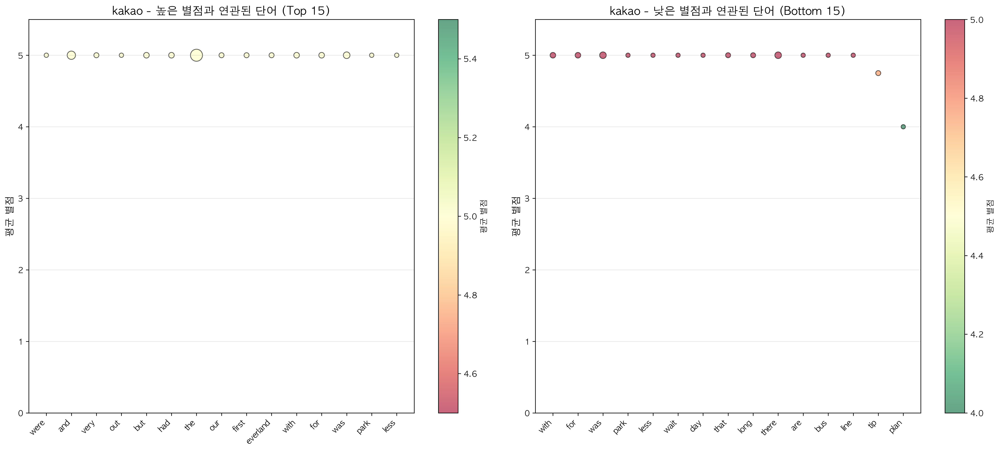

Insights:

* 감성 분류의 특이점: 별점은 매우 높으나 감성 사전 기반 분석 시 '약간 부정적' 카테고리에 가장 많은 리뷰가 분류되는 불일치 현상이 나타납니다. 이는 '사람이 너무 많다'와 같이 긍정적 방문 맥락에서 쓰인 강조 표현이 부정어로 인식된 결과로 해석됩니다.

* 상관계수: 감성 점수와 별점 간의 상관관계는 0.032로 매우 낮게 나타나, 텍스트 내용과 별점이 반드시 선형적으로 일치하지 않음을 시사합니다.

* 주요 단어: 고득점과 연관된 주요 단어로 'everland', 'park' 등이 나타나며, 상대적으로 낮은 별점과 연결된 단어로는 'tip', 'plan' 등이 확인되어 방문 계획이나 팁 공유 과정에서의 경험이 점수에 영향을 미침을 알 수 있습니다.
  

* 더 자세한 내용은 review_analysis/plots/ 폴더 내에서 확인 가능합니다! 

---

### 4-3) 개별 분석 - Tripcom

### 1. Rating Distribution (별점 분포)
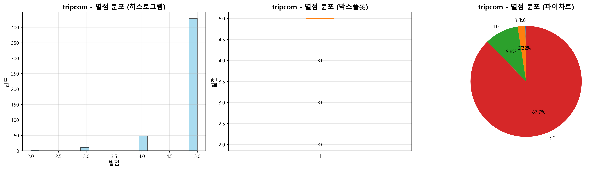

Insights:

* 압도적인 만족도: 분석한 세 플랫폼 중 가장 높은 긍정 비율을 보입니다. 5점이 87.7%, 4점이 9.8%로 전체 리뷰의 약 97.5%가 긍정적인 평가입니다.

* 부정 리뷰의 희소성: 1~2점대의 낮은 별점은 거의 찾아볼 수 없으며, Boxplot 상에서도 데이터가 5점에 극도로 집중되어 있음을 확인할 수 있습니다.

### 2. Text Length Analysis (리뷰 길이 분석)
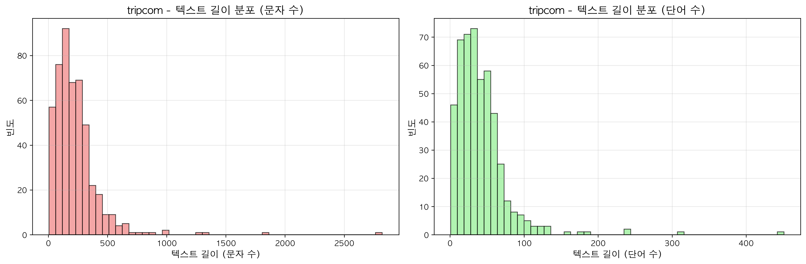

Insights:

* 중단문 위주의 정보 공유: 리뷰 길이는 주로 150-300자 내외에 분포하며, 단어 수는 30-60단어 사이가 가장 많습니다.

* 카카오 대비 상세함: 단순 별점 위주인 카카오맵보다는 길고, 구글 맵스보다는 조금 더 정제된 형태의 경험 공유가 이루어지고 있습니다.

### 3. Temporal Patterns (시간별 리뷰 추이)
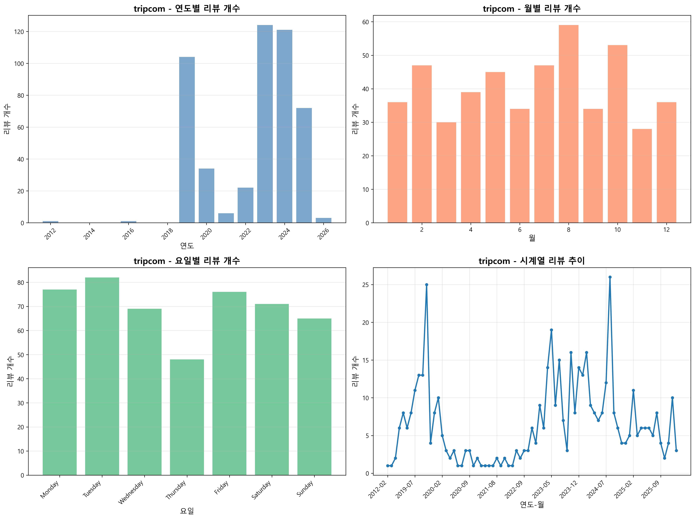

Insights:

* 포스트 코로나 급증: 2019년 소폭 상승 후 하락했다가, 2023년과 2024년에 리뷰 수가 폭발적으로 증가하며 글로벌 관광객의 에버랜드 방문 회복세를 입증합니다.

* 여름 휴가 및 요일 특성: 월별로는 8월에 가장 높은 빈도를 보이며, 요일별로는 화요일에 리뷰 작성이 가장 활발합니다. 이는 주말 방문객이 평일 초반에 리뷰를 정리해서 남기는 패턴으로 해석됩니다.

### 4. Sentiment & Word Correlation (감성 및 단어 상관관계)
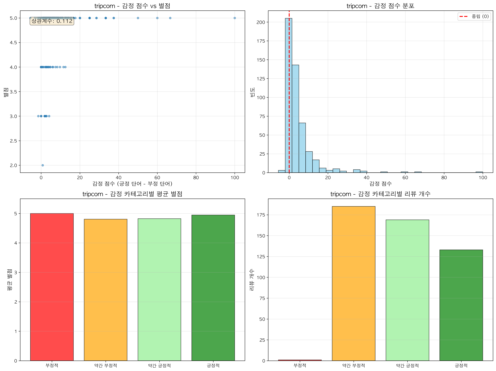  

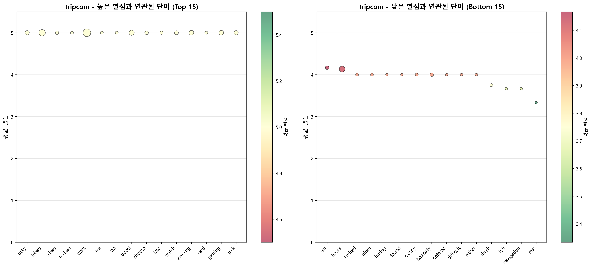

Insights:

* 가장 높은 감성 일치도: 감성 점수와 별점 간의 상관계수가 0.112로, 타 플랫폼 대비 텍스트의 긍정 수치와 실제 별점이 비교적 잘 일치하는 경향을 보입니다.

* 팬더(Panda) 효과: 고득점과 연관된 핵심 단어로 'lucky', 'lebao', 'huibao' 등이 등장하여, 푸바오 일가 등 판다 콘텐츠가 외국인 관광객의 높은 만족도에 결정적인 역할을 했음을 보여줍니다.

* 페인 포인트: 낮은 별점과 연관된 단어로는 'hours', 'limited', 'navigation' 등이 확인되어, 운영 시간이나 공원 내 길 찾기(내비게이션) 등의 편의성 개선이 글로벌 유저들에게 중요한 요소임을 시사합니다.
  

* 더 자세한 내용은 review_analysis/plots/ 폴더 내에서 확인 가능합니다! 

---

## 4-2. GitHub 협업 과제 

1) Branch Protection Rule 설정 

`main` 브랜치에 직접적인 `push`를 금지하고, 반드시 `Pull Request`와 리뷰를 거치도록 설정하였습니다.

* **브랜치 보호 규칙 적용 스크린샷**  


* **직접 Push 시도 시 거부 화면**  


2) Pull Request & Review 절차 

각 팀원은 개별 브랜치에서 작업 후 PR을 생성하였으며, 팀원의 리뷰 및 승인을 얻어 `merge`를 진행하였습니다.

* **풀리퀘스트 리뷰 및 머지 완료 화면**  


---
